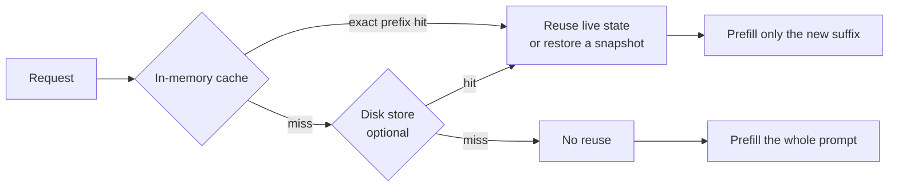
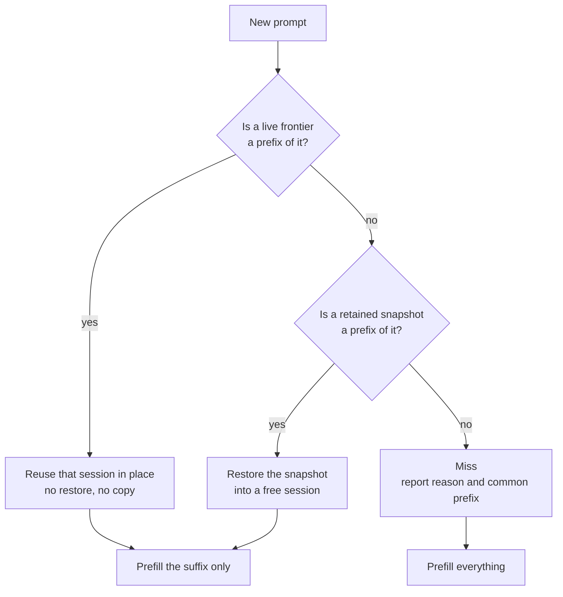
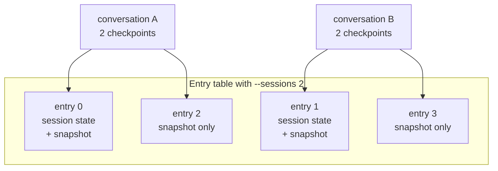

# KV Cache

## What "KV cache" means here

Two different things share the name. Keeping them apart avoids most of the
confusion.

**Within one request.** The standard transformer mechanism. Prefill computes
key and value tensors for every prompt token once; decode then appends one K/V
pair per generated token and attends over the stored set. Without it, each new
token would re-run attention across the whole sequence. This is intrinsic to
inference and is not configurable.

**Across requests.** Keeping that state alive after a response finishes, so
the next turn of the same conversation does not recompute the prefix it shares
with the previous one. This is what the rest of this document is about: the
`ContinuationCache`, and the optional on-disk tier behind `--cache-disk`.

The second is where the important subtlety lives. What Gufo retains is **not**
literally K/V tensors. It is an opaque snapshot owned by the model runner. For
Qwen3.8-27B that payload happens to be attention KV. For Qwen3.8-Flash-Next it
also contains GDN recurrent state, the indexer, position and sampling state.
The cache cannot inspect or interpret those bytes.

That choice buys one retention, admission, eviction and persistence mechanism
that is correct for every model, including hybrid-recurrent ones. It costs the
ability to trim a checkpoint: a saved snapshot can only be reused **whole**,
and only when its tokens are an exact prefix of the new prompt.

## Why it exists

Prefill cost scales with prompt length. Decode cost scales with tokens
generated. Agent conversations have a large prompt and a small output, and
turn *N*'s prompt is nearly all of turn *N−1*'s prompt. Without cross-request
reuse, every turn pays for the whole conversation again and total cost grows
quadratically with conversation length.

What reuse is worth, same conversation, second turn against a cold start
**(measured)**:

| Model | Prompt | Cold | Reused |
| --- | ---: | ---: | ---: |
| Qwen3.8-27B | 101,545 | 280.4 s | 2.4 s |
| Qwen3.8-Flash-Next | 203,047 | 184.4 s | 0.7 s |

A recorded 28-turn `pi` coding session reused 95.9% of its prompt tokens. The
same session replayed with reuse broken reprocessed 9.3x the tokens and took
2.5x the wall time, at only 15k tokens **(measured)**.

## The shape of the system



The in-memory tier is always on. The disk tier is opt-in, adds restart safety,
and can additionally *learn* boundaries between conversations that merely share
a prefix.

## Finding reuse

A request arrives with a token sequence. The cache looks for the longest
retained prefix of it, in two different forms.



A **live frontier** is where a session's state actually ended up after its last
request, including the tokens it generated. It is preferred even when a
snapshot matches the same length, because the state is already sitting there:
no restore and no device copy. This is why continuing the previous turn of a
conversation is nearly free, and why reuse can cover generated tokens and not
just prompt tokens.

A **snapshot** is an immutable retained checkpoint. Reusing one means restoring
it into a session, which costs a copy.

Both require an **exact prefix match**. The cache still computes the longest
common prefix on a miss and reports it, which is why a miss can say "we agreed
on 7,094 of your 7,103 tokens" and still re-prefill everything: it had no
checkpoint at that position to resume from.

### Worked example

A conversation with a 5,000-token system prompt, thinking off, client replaying
the assistant turn verbatim:

| Turn | Prompt | Reused | Prefilled | Why |
| --- | ---: | ---: | ---: | --- |
| 1 | 5,020 | 0 | 5,020 | nothing retained yet |
| 2 | 5,320 | 5,020 | 300 | live frontier from turn 1 |
| 3 | 5,620 | 5,320 | 300 | live frontier from turn 2 |

Now change one thing: edit the *last user message* of turn 3 and resend. The
first 5,320 tokens are byte-identical, but the divergence falls after the last
retained checkpoint, so there is nothing to resume from:

| Turn | Prompt | Reused | Prefilled | Common prefix |
| --- | ---: | ---: | ---: | ---: |
| 3' | 5,620 | 0 | 5,620 | 5,599 |

That gap between "common prefix" and "reused" is the signature of the
exact-prefix limitation. See #331.

## What gets retained

The unit of retention is a **checkpoint**, not a conversation. A single request
can retain two: the frontier it reused, frozen before prefill mutates it, and
its own boundary or complete prompt.

The entry table holds `sessions x 2` entries. The first `sessions` of them own
a real session state and are the only ones a request can execute in; the rest
exist purely to hold snapshots.



Two checkpoints per conversation against `sessions x 2` entries means the cache
holds roughly **`--sessions` conversations** (source, matching measurement).
This is the most frequently misread part of the configuration: `--sessions` is
normally chosen for request concurrency, but it also bounds how many distinct
conversations stay resumable.

Exceeding it does not degrade gradually. With round-robin traffic the entry
about to be needed is always the least recently used one, so reuse collapses
from about 95% to 0% when conversations exceed sessions by one **(measured)**.
See #341.

The limit is reported at startup:

```text
event=snapshot_cache_configured sessions=2 snapshot_entries=4 retained_conversations=2 capacity_bytes=99007139840
```

## Invariants

These constraints are why several design choices are not preferences. Change
them deliberately or not at all.

**A snapshot can only be captured where the state actually sits.** The runner
serialises the state as it is; there is no way to capture position *N* while
the state is at *M*. Retaining a checkpoint at a stable boundary therefore
requires prefill to **stop** at that boundary. A warm continuation cannot both
reuse a frontier and retain its own boundary in a single uninterrupted pass.

**The reused frontier must be frozen before prefill.** Prefill mutates the
leased state in place, so a frontier another request might branch from has to
be captured first.

**Admission is advisory, never fatal.** A refused reservation or a failed
capture is a skipped optimisation. The request must still complete.

**Eviction cannot skip a victim.** If removing an entry fails, the eviction
loop stops rather than trying the next candidate, in both tiers **(source)**.

## Limits

Three budgets, each able to bind first.

| Limit | Default | Set by |
| --- | --- | --- |
| Retained snapshot bytes, RAM | `MemAvailable / 2` | not configurable |
| Disk bytes | 8 GiB | `--cache-disk-bytes` |
| Disk staging bytes | smallest of 1 GiB, `MemAvailable / 8`, the disk budget | `--cache-disk-staging-bytes` |

The RAM budget is sampled **after** the model and sessions are allocated, then
halved. It therefore shrinks as `--context` and `--sessions` grow, which is
exactly when snapshots are largest. On Flash-Next at 262144 context a single
snapshot reached 5.70 GB against a 7.76 GB budget, so a second could not be
retained **(measured)**. See #343.

Snapshot size scales with retained tokens and differs sharply between models:
roughly 0.5 GB at 5k tokens on Flash-Next, and 3.7 GB at 24k tokens on
Qwen3.8-27B **(measured)**. The 1 GiB disk staging default is therefore below a
single 27B checkpoint at moderate depth, which reduces `--cache-disk` to a
no-op unless raised. See #259.

Eviction is least-recently-used in both tiers, with no awareness of
conversation, prefix depth or rebuild cost.

## The disk tier

`--cache-disk DIR` adds a second tier that survives restarts. A checkpoint
written before a restart restored a 24,866-token prompt in 1.8 s against about
50 s for a cold prefill **(measured)**.

It also does something the memory tier cannot: it **learns shared-prefix
boundaries**. When several prompts share a long prefix and then diverge, it can
capture a checkpoint at the divergence point so later conversations resume from
it. This is why a system prompt shared across separate conversations is
reusable with `--cache-disk` and not without. The boundary is not learned on
first sight; in one run it became usable from the fifth conversation
**(measured)**. See #267.

Disk entries are evicted by global LRU on last access, so one active run whose
checkpoints are all recent will displace every other conversation in age order
**(measured)**. See #275.

## What invalidates reuse

Anything that changes the token prefix. In practice:

- **Tool definitions** — adding, removing or reordering changes the prompt head
  and invalidates everything after it.
- **System prompt** — including anything volatile inside it, such as a
  timestamp or a working directory.
- **Response schema** — `response_format` is rendered into the prompt.
- **Images** — changing, removing or moving an earlier image invalidates
  checkpoints after it. Appending a new one does not.
- **Reasoning the client cannot replay** — thinking is on by default for Qwen
  and `reasoning_content` is not part of the OpenAI schema, so an ordinary
  client omits it when sending the conversation back. The retained checkpoint
  then stops advancing for the rest of the session **(measured)**. See #335.

These do **not** invalidate reuse **(measured)**: changing `temperature`,
`top_p`, `seed`, `max_tokens`, penalties or `stop` between turns; streaming
versus not, which reuse identically and interoperate within one conversation.

`cache_prompt: false` bypasses lookup for a single request. The result can
still populate the cache.

## Observing it

| Log line | Meaning |
| --- | --- |
| `event=snapshot_cache_configured` | retained capacity, at startup |
| `event=snapshot action=removed reason=entry_capacity` | a retained prefix was evicted because every entry was taken |
| `event=snapshot action=skipped reason=byte_capacity` | a checkpoint did not fit the RAM budget |
| `event=disk_cache action=removed reason=lru` | a disk entry was evicted to stay inside `--cache-disk-bytes` |
| `event=disk_cache action=skipped reason=staging_capacity` | a checkpoint exceeded `--cache-disk-staging-bytes` and was never written |

Per-request outcomes appear in the completion log and in `usage.gufo`:
`cache_hit`, `cache_miss_reason`, `cache_common_prefix_tokens`,
`cache_checkpoint_tokens`, `cache_restore_bytes`, `cache_restore_ms`, plus
`prompt_n` (newly processed) and `cache_n` (reused) in the llama.cpp-compatible
`timings` object. Miss reasons are `no_checkpoint`, `prefix_changed`,
`input_changed` and `disabled`.

Reading them:

- `cache_n` growing turn over turn while `prompt_n` stays flat is healthy
  reuse.
- `cache_n` **pinned** at the same value while `prompt_n` grows every turn is a
  checkpoint that stopped advancing. See #335.
- A large `cache_common_prefix_tokens` on a miss means a long prefix agreed and
  could not be resumed from: a mid-history edit, or an evicted checkpoint.

## Verifying changes

- `tools/serving/check-continuation.py` covers cancellation, reasoning replay,
  images and restart persistence against a live server.
- `tests/cli/continuation_cache_test.cpp`,
  `tests/cli/continuation_disk_store_test.cpp` and
  `tests/cli/text_model_runner_test.cpp` cover retention, admission, eviction
  and the event sinks without loading a model.

## Known gaps

Tracked under #336, with the upstream reports #331, #335, #259, #267, #275,
#300 and #318.
