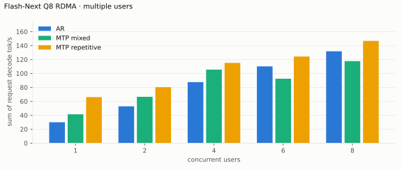

# Qwen3.8 Flash-Next benchmarks

AMD Strix Halo `gfx1151`, 128 GB unified memory. Unsloth `UD-Q4_K_XL` target and
shared-Q8_0 MTP sidecar; Gufo uses adaptive MTP. HTTP, greedy, thinking off.
Positive gain favors Gufo.
[Quality and measurement details](QUALITY.md#benchmark-method) · [Model identities](artifacts/model-identities.json)

- [Single Strix Halo](#single-strix-halo): Gufo against llama.cpp.
- [Two Strix Halos over RDMA](#two-strix-halos-over-rdma): Gufo RDMA against
  Gufo on one host, deeper contexts, and the full Q8 model.

## Single Strix Halo

Gufo single-user pp/tg: October 7, 2026 (`def2ed1e`), Performance power
profile; concurrency, loading, memory and reference results: September 22–23.
Concurrency uses the unchanged short-context attention path. llama.cpp uses
`b11069` for AR and `6fcaa16f` for MTP.

### Single user, autoregressive

Approximately pp2048 / tg128; depth is the cached prefix in tokens.
Context capacities differ between engines; see the measurement details.

<!-- bench:single-ar -->
| Flash-Next Q4 AR Depth (tokens) | Gufo pp (tok/s) | llama.cpp pp (tok/s) | Gain | Gufo tg (tok/s) | llama.cpp tg (tok/s) | Gain |
| ---: | ---: | ---: | ---: | ---: | ---: | ---: |
| 0 | 1644.68 | 489.59 | +235.9% | 25.99 | 22.20 | +17.1% |
| 4,096 | 1518.57 | 455.24 | +233.6% | 25.73 | 21.21 | +21.3% |
| 8,192 | 1567.32 | 428.85 | +265.5% | 25.99 | 20.40 | +27.4% |
| 12,288 | 1560.97 | 400.21 | +290.0% | 25.96 | 19.64 | +32.2% |
| 16,384 | 1556.02 | 375.89 | +314.0% | 25.93 | 18.95 | +36.8% |
| 32,768 | 1546.81 | 301.31 | +413.4% | 25.80 | 16.54 | +56.0% |
| 65,536 | 1425.49 | 221.94 | +542.3% | 25.43 | 11.62 | +118.8% |
| 131,072 | 1446.10 | 144.78 | +898.8% | 24.97 | 7.98 | +212.9% |
<!-- /bench -->

### Single user, MTP

pp is the highest measured rate per engine and depth across mixed/repetitive
text, including Gufo predictor catch-up.

<!-- bench:single-mtp -->
| Flash-Next Q4 MTP Depth (tokens) | Gufo pp (tok/s) | llama.cpp pp (tok/s) | Gain pp | Gufo tg mixed (tok/s) | llama.cpp tg mixed (tok/s) | Gain mixed | Gufo tg repetitive (tok/s) | llama.cpp tg repetitive (tok/s) | Gain repetitive |
| ---: | ---: | ---: | ---: | ---: | ---: | ---: | ---: | ---: | ---: |
| 0 | 1560.11 | 468.76 | +232.8% | 30.16 | 31.73 | -4.9% | 59.02 | 48.12 | +22.7% |
| 4,096 | 1529.17 | 423.79 | +260.8% | 32.86 | 34.48 | -4.7% | 57.58 | 45.71 | +26.0% |
| 8,192 | 1525.11 | 394.98 | +286.1% | 32.47 | 32.20 | +0.8% | 49.26 | 44.31 | +11.2% |
| 12,288 | 1517.04 | 365.91 | +314.6% | 34.78 | 32.32 | +7.6% | 42.19 | 43.53 | -3.1% |
| 16,384 | 1502.95 | 341.98 | +339.5% | 35.27 | 32.07 | +10.0% | 50.60 | 43.66 | +15.9% |
| 32,768 | 1503.08 | 277.61 | +441.4% | 34.27 | 25.41 | +34.9% | 44.98 | 39.28 | +14.5% |
| 65,536 | 1390.03 | 208.04 | +568.2% | 33.51 | 19.65 | +70.5% | 43.12 | 27.75 | +55.4% |
| 131,072 | 1408.06 | 135.42 | +939.8% | 33.18 | 14.63 | +126.8% | 44.43 | 20.96 | +112.0% |
<!-- /bench -->

### Multiple users, autoregressive

Same pp2048 prose prompt as single-user d0, tg128, context 4096 per user.
All sessions prefilled before timed decoding; throughput sums individual rates.
llama.cpp re-evaluates its four-token checkpoint tail.

<!-- bench:multi-ar -->
| Flash-Next Q4 AR Users | Gufo AR (tok/s) | llama.cpp AR (tok/s) | Gain |
| ---: | ---: | ---: | ---: |
| 1 | 25.85 | 22.34 | +15.7% |
| 2 | 45.70 | 37.08 | +23.2% |
| 4 | 76.29 | 54.82 | +39.2% |
| 6 | 95.66 | 65.34 | +46.4% |
| 8 | 108.67 | 68.79 | +58.0% |
<!-- /bench -->

### Multiple users, MTP

Same pp2048 mixed/repetitive prompts as single-user d0, tg128, context 4096
per user. All sessions prefilled before timed decoding; rates sum individual
request decode rates. C1 cross-checks the single-user table.

<!-- bench:multi-mtp -->
| Flash-Next Q4 MTP Users | Gufo mixed (tok/s) | llama.cpp mixed (tok/s) | Gain | Gufo repetitive (tok/s) | llama.cpp repetitive (tok/s) | Gain |
| ---: | ---: | ---: | ---: | ---: | ---: | ---: |
| 1 | 32.09 | 31.77 | +1.0% | 59.20 | 46.93 | +26.1% |
| 2 | 51.68 | 42.79 | +20.8% | 93.16 | 52.57 | +77.2% |
| 4 | 75.92 | 48.78 | +55.6% | 127.91 | 48.23 | +165.2% |
| 6 | 89.18 | 52.59 | +69.6% | 142.14 | 48.51 | +193.0% |
| 8 | 106.47 | 61.92 | +71.9% | 157.22 | 58.13 | +170.5% |
<!-- /bench -->

### Loading time

C1, context capacity 262144, MTP. Cold target/sidecar files to HTTP readiness.

<!-- bench:loading -->
| Flash-Next Q4 Target | Gufo ready (s) | llama.cpp ready (s) | Gain |
| --- | ---: | ---: | ---: |
| Q4 | 15.45 | 117.83 | +662.7% |
<!-- /bench -->

### Memory occupation

C1, context capacity 133121, AR. Peak memory reported by HIP.

<!-- bench:memory -->
| Flash-Next Q4 AR Workload | Gufo GiB | llama.cpp GiB | Gain |
| --- | ---: | ---: | ---: |
| pp2048 + tg128 | 85.55 | 84.84 | -0.8% |
| 16K prefix, pp4096 + tg128 | 86.27 | 85.31 | -1.1% |
<!-- /bench -->

## Two Strix Halos over RDMA

Gufo RDMA runs one model on two such hosts: every layer is split between them,
and they exchange partial sums over RDMA ([how it works](TP2.md)).
The workloads are those of the one-host tables; "Gufo" is the same build on
one host, and gain is Gufo RDMA over it. With twice the memory, single users
also reach depths one host cannot (context capacity 262144). Every RDMA table
was measured on October 9, 2026 (`c85349b5`) over USB4 RoCE v2, with the
same-build one-host runs beside them, in the balanced power mode (85 W
sustained), so prefill is lower than in the one-host tables above; decode is
not power-bound. Over USB4 a fresh 2K prompt prefills more slowly than on one
host; with a cached prefix, prefill gains 3–15%.

### Single user, autoregressive

<!-- bench:single-ar-tp2 -->
| Flash-Next Q4 AR Depth (tokens) | Gufo pp (tok/s) | Gufo RDMA pp (tok/s) | Gain | Gufo tg (tok/s) | Gufo RDMA tg (tok/s) | Gain |
| ---: | ---: | ---: | ---: | ---: | ---: | ---: |
| 0 | 1492.22 | 1299.73 | -12.9% | 26.71 | 32.91 | +23.2% |
| 4,096 | 1342.09 | 1412.63 | +5.3% | 26.69 | 32.81 | +22.9% |
| 32,768 | 1270.29 | 1456.89 | +14.7% | 26.08 | 32.53 | +24.7% |
| 65,536 | 1255.97 | 1431.71 | +14.0% | 26.23 | 32.23 | +22.9% |
| 131,072 | 1216.31 | 1317.83 | +8.3% | 25.71 | 31.31 | +21.8% |
| 258,048 | — | 1221.33 | — | — | 30.10 | — |
<!-- /bench -->

### Single user, MTP

<!-- bench:single-mtp-tp2 -->
| Flash-Next Q4 MTP Depth (tokens) | Gufo pp (tok/s) | Gufo RDMA pp (tok/s) | Gain pp | Gufo tg mixed (tok/s) | Gufo RDMA tg mixed (tok/s) | Gain mixed | Gufo tg repetitive (tok/s) | Gufo RDMA tg repetitive (tok/s) | Gain repetitive |
| ---: | ---: | ---: | ---: | ---: | ---: | ---: | ---: | ---: | ---: |
| 0 | 1420.72 | 1346.32 | -5.2% | 32.03 | 37.88 | +18.3% | 60.11 | 79.33 | +32.0% |
| 4,096 | 1301.51 | 1333.77 | +2.5% | 33.25 | 47.46 | +42.7% | 56.03 | 60.82 | +8.5% |
| 32,768 | 1231.99 | 1389.59 | +12.8% | 33.11 | 38.62 | +16.6% | 40.61 | 65.63 | +61.6% |
| 65,536 | 1216.20 | 1314.17 | +8.1% | 33.78 | 47.55 | +40.8% | 43.33 | 57.69 | +33.1% |
| 131,072 | 1208.61 | 1275.75 | +5.6% | 34.21 | 41.46 | +21.2% | 39.90 | 55.62 | +39.4% |
| 258,048 | — | 1169.31 | — | — | 38.02 | — | — | 57.38 | — |
<!-- /bench -->

### Multiple users, autoregressive

Same pp2048 prose prompt, tg128, context 4096 per user; every session
prefills before timed decoding. Rates sum individual decode rates.

<!-- bench:multi-ar-tp2 -->
| Flash-Next Q4 AR Users | Gufo AR (tok/s) | Gufo RDMA AR (tok/s) | Gain |
| ---: | ---: | ---: | ---: |
| 1 | 25.09 | 32.89 | +31.1% |
| 2 | 46.95 | 56.77 | +20.9% |
| 4 | 77.27 | 92.79 | +20.1% |
| 6 | 96.79 | 115.69 | +19.5% |
| 8 | 109.03 | 137.86 | +26.4% |
<!-- /bench -->

### Multiple users, MTP

Same configuration and preparation as the AR table, with mixed/repetitive
prompts. Every prepared completion, on both topologies and in all modes, matches
its fresh one-user AR control.

<!-- bench:multi-mtp-tp2 -->
| Flash-Next Q4 MTP Users | Gufo mixed (tok/s) | Gufo RDMA mixed (tok/s) | Gain | Gufo repetitive (tok/s) | Gufo RDMA repetitive (tok/s) | Gain |
| ---: | ---: | ---: | ---: | ---: | ---: | ---: |
| 1 | 32.04 | 37.75 | +17.8% | 60.16 | 74.16 | +23.3% |
| 2 | 53.57 | 66.98 | +25.0% | 84.28 | 113.63 | +34.8% |
| 4 | 77.13 | 92.34 | +19.7% | 124.27 | 160.23 | +28.9% |
| 6 | 96.19 | 108.78 | +13.1% | 134.85 | 176.43 | +30.8% |
| 8 | 106.50 | 127.06 | +19.3% | 149.87 | 191.36 | +27.7% |
<!-- /bench -->

### Full Q8 model

The full Q8_0 target does not fit one host. Single user, pp2048/tg128 by depth
as above; prefill on the left axis, generation on the right.

<!-- bench:tp2-q8 -->
| Flash-Next Q8 RDMA Depth (tokens) | pp (tok/s) | tg AR (tok/s) | tg MTP mixed (tok/s) | tg MTP repetitive (tok/s) |
| ---: | ---: | ---: | ---: | ---: |
| 0 | 1193.06 | 29.80 | 41.15 | 65.99 |
| 4,096 | 1169.94 | 29.52 | 37.83 | 55.31 |
| 32,768 | 1176.27 | 29.64 | 42.44 | 60.15 |
| 65,536 | 1140.63 | 28.91 | 44.19 | 52.40 |
| 131,072 | 1120.59 | 28.50 | 36.88 | 56.22 |
| 258,048 | 1041.67 | 27.60 | 39.34 | 50.64 |
<!-- /bench -->

Multiple users with the configuration and preparation of the Q4 tables:

<!-- bench:tp2-q8-multi -->
| Flash-Next Q8 RDMA Users | AR (tok/s) | MTP mixed (tok/s) | MTP repetitive (tok/s) |
| ---: | ---: | ---: | ---: |
| 1 | 29.97 | 41.33 | 65.99 |
| 2 | 52.82 | 66.48 | 80.25 |
| 4 | 87.52 | 105.45 | 115.17 |
| 6 | 110.17 | 92.40 | 124.27 |
| 8 | 131.79 | 117.69 | 146.72 |
<!-- /bench -->

Q8 MTP rates vary more between server starts than between cohorts of one
start: a second start with three cohorts per point gave mixed 90.06 (C4) and
105.40 (C6), repetitive 115.74 (C4) and 118.65 (C6) tok/s, each cohort within
3% of its point's rate.
