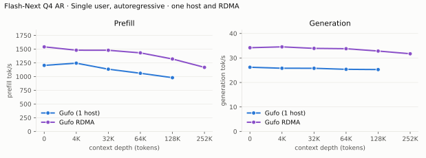
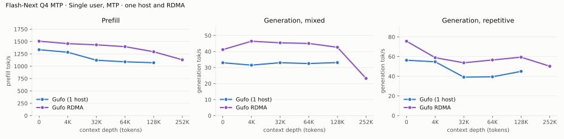
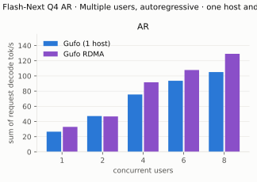
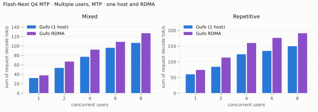
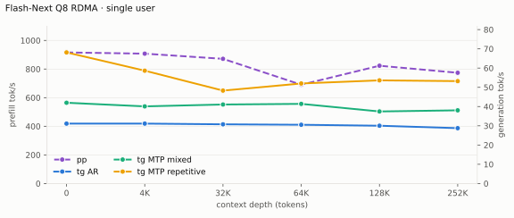

# Qwen3.8 Flash-Next benchmarks

AMD Strix Halo `gfx1151`, 128 GB unified memory. Unsloth `UD-Q4_K_XL` target and
shared-Q8_0 MTP sidecar; Gufo uses adaptive MTP. HTTP, greedy, thinking off.
Positive gain favors Gufo.
[Quality and measurement details](QUALITY.md#benchmark-method) · [Model identities](artifacts/model-identities.json)

- [Single Strix Halo](#single-strix-halo): Gufo against llama.cpp.
- [Two Strix Halos over RDMA](#two-strix-halos-over-rdma): Gufo RDMA against
  Gufo on one host, deeper contexts, and the full Q8 model.

## Single Strix Halo

Gufo single-user pp/tg: October 6, 2026 (`4c5a00d2`); concurrency, loading,
memory and reference results: September 22–23. Concurrency uses the unchanged
short-context attention path. llama.cpp uses `b11069` for AR and `6fcaa16f`
for MTP.

### Single user, autoregressive

Approximately pp2048 / tg128; depth is the cached prefix in tokens.
Context capacities differ between engines; see the measurement details.

<!-- bench:single-ar -->
| Flash-Next Q4 AR Depth (tokens) | Gufo pp (tok/s) | llama.cpp pp (tok/s) | Gain | Gufo tg (tok/s) | llama.cpp tg (tok/s) | Gain |
| ---: | ---: | ---: | ---: | ---: | ---: | ---: |
| 0 | 1639.03 | 489.59 | +234.8% | 25.96 | 22.20 | +16.9% |
| 4,096 | 1564.36 | 455.24 | +243.6% | 25.96 | 21.21 | +22.4% |
| 8,192 | 1557.47 | 428.85 | +263.2% | 25.95 | 20.40 | +27.2% |
| 12,288 | 1553.60 | 400.21 | +288.2% | 25.93 | 19.64 | +32.0% |
| 16,384 | 1553.97 | 375.89 | +313.4% | 25.89 | 18.95 | +36.6% |
| 32,768 | 1540.25 | 301.31 | +411.2% | 25.75 | 16.54 | +55.7% |
| 65,536 | 1459.69 | 221.94 | +557.7% | 25.50 | 11.62 | +119.4% |
| 131,072 | 1444.79 | 144.78 | +897.9% | 24.90 | 7.98 | +212.0% |
<!-- /bench -->

### Single user, MTP

pp is the highest measured rate per engine and depth across mixed/repetitive
text, including Gufo predictor catch-up.

<!-- bench:single-mtp -->
| Flash-Next Q4 MTP Depth (tokens) | Gufo pp (tok/s) | llama.cpp pp (tok/s) | Gain pp | Gufo tg mixed (tok/s) | llama.cpp tg mixed (tok/s) | Gain mixed | Gufo tg repetitive (tok/s) | llama.cpp tg repetitive (tok/s) | Gain repetitive |
| ---: | ---: | ---: | ---: | ---: | ---: | ---: | ---: | ---: | ---: |
| 0 | 1584.63 | 468.76 | +238.0% | 31.33 | 31.73 | -1.3% | 60.36 | 48.12 | +25.4% |
| 4,096 | 1528.90 | 423.79 | +260.8% | 32.83 | 34.48 | -4.8% | 57.61 | 45.71 | +26.0% |
| 8,192 | 1528.87 | 394.98 | +287.1% | 32.41 | 32.20 | +0.7% | 49.22 | 44.31 | +11.1% |
| 12,288 | 1511.31 | 365.91 | +313.0% | 34.72 | 32.32 | +7.4% | 42.17 | 43.53 | -3.1% |
| 16,384 | 1503.69 | 341.98 | +339.7% | 35.21 | 32.07 | +9.8% | 50.56 | 43.66 | +15.8% |
| 32,768 | 1501.78 | 277.61 | +441.0% | 34.21 | 25.41 | +34.6% | 44.99 | 39.28 | +14.5% |
| 65,536 | 1415.89 | 208.04 | +580.6% | 33.50 | 19.65 | +70.5% | 44.45 | 27.75 | +60.2% |
| 131,072 | 1403.96 | 135.42 | +936.7% | 33.10 | 14.63 | +126.2% | 44.34 | 20.96 | +111.5% |
<!-- /bench -->

### Multiple users, autoregressive

Same pp2048 prose prompt as single-user d0, tg128, context 4096 per user.
All sessions prefilled before timed decoding; throughput sums individual rates.
llama.cpp re-evaluates its four-token checkpoint tail.

<!-- bench:multi-ar -->
| Flash-Next Q4 AR Users | Gufo AR (tok/s) | llama.cpp AR (tok/s) | Gain |
| ---: | ---: | ---: | ---: |
| 1 | 25.85 | 22.34 | +15.7% |
| 2 | 45.70 | 37.08 | +23.2% |
| 4 | 76.29 | 54.82 | +39.2% |
| 6 | 95.66 | 65.34 | +46.4% |
| 8 | 108.67 | 68.79 | +58.0% |
<!-- /bench -->

### Multiple users, MTP

Same pp2048 mixed/repetitive prompts as single-user d0, tg128, context 4096
per user. All sessions prefilled before timed decoding; rates sum individual
request decode rates. C1 cross-checks the single-user table.

<!-- bench:multi-mtp -->
| Flash-Next Q4 MTP Users | Gufo mixed (tok/s) | llama.cpp mixed (tok/s) | Gain | Gufo repetitive (tok/s) | llama.cpp repetitive (tok/s) | Gain |
| ---: | ---: | ---: | ---: | ---: | ---: | ---: |
| 1 | 32.09 | 31.77 | +1.0% | 59.20 | 46.93 | +26.1% |
| 2 | 51.68 | 42.79 | +20.8% | 93.16 | 52.57 | +77.2% |
| 4 | 75.92 | 48.78 | +55.6% | 127.91 | 48.23 | +165.2% |
| 6 | 89.18 | 52.59 | +69.6% | 142.14 | 48.51 | +193.0% |
| 8 | 106.47 | 61.92 | +71.9% | 157.22 | 58.13 | +170.5% |
<!-- /bench -->

### Loading time

C1, context capacity 262144, MTP. Cold target/sidecar files to HTTP readiness.

<!-- bench:loading -->
| Flash-Next Q4 Target | Gufo ready (s) | llama.cpp ready (s) | Gain |
| --- | ---: | ---: | ---: |
| Q4 | 15.45 | 117.83 | +662.7% |
<!-- /bench -->

### Memory occupation

C1, context capacity 133121, AR. Peak memory reported by HIP.

<!-- bench:memory -->
| Flash-Next Q4 AR Workload | Gufo GiB | llama.cpp GiB | Gain |
| --- | ---: | ---: | ---: |
| pp2048 + tg128 | 85.55 | 84.84 | -0.8% |
| 16K prefix, pp4096 + tg128 | 86.27 | 85.31 | -1.1% |
<!-- /bench -->

## Two Strix Halos over RDMA

Gufo RDMA runs one model on two such hosts: every layer is split between them,
and they exchange partial sums over RDMA ([how it works](TP2.md)).
The workloads are those of the one-host tables; "Gufo" is the same build on
one host, and gain is Gufo RDMA over it. With twice the memory, single users
also reach depths one host cannot (context capacity 262144). The Q4 single-user
comparisons were measured on September 29, 2026 (`ea76571`) in the balanced power mode (85 W sustained),
so prefill is lower than in the one-host tables above; decode is not
power-bound.

### Single user, autoregressive

<!-- bench:single-ar-tp2 -->
| Flash-Next Q4 AR Depth (tokens) | Gufo pp (tok/s) | Gufo RDMA pp (tok/s) | Gain | Gufo tg (tok/s) | Gufo RDMA tg (tok/s) | Gain |
| ---: | ---: | ---: | ---: | ---: | ---: | ---: |
| 0 | 1203.95 | 1541.16 | +28.0% | 26.21 | 34.19 | +30.4% |
| 4,096 | 1243.96 | 1480.06 | +19.0% | 25.81 | 34.54 | +33.8% |
| 32,768 | 1134.13 | 1479.06 | +30.4% | 25.79 | 33.92 | +31.5% |
| 65,536 | 1060.00 | 1431.50 | +35.0% | 25.37 | 33.78 | +33.1% |
| 131,072 | 979.47 | 1320.03 | +34.8% | 25.27 | 32.83 | +29.9% |
| 258,048 | — | 1167.63 | — | — | 31.72 | — |
<!-- /bench -->

### Single user, MTP

<!-- bench:single-mtp-tp2 -->
| Flash-Next Q4 MTP Depth (tokens) | Gufo pp (tok/s) | Gufo RDMA pp (tok/s) | Gain pp | Gufo tg mixed (tok/s) | Gufo RDMA tg mixed (tok/s) | Gain mixed | Gufo tg repetitive (tok/s) | Gufo RDMA tg repetitive (tok/s) | Gain repetitive |
| ---: | ---: | ---: | ---: | ---: | ---: | ---: | ---: | ---: | ---: |
| 0 | 1334.06 | 1505.96 | +12.9% | 33.00 | 41.20 | +24.8% | 56.25 | 75.58 | +34.4% |
| 4,096 | 1282.50 | 1457.15 | +13.6% | 31.51 | 46.44 | +47.4% | 54.69 | 58.86 | +7.6% |
| 32,768 | 1121.21 | 1432.81 | +27.8% | 33.03 | 45.44 | +37.6% | 39.11 | 53.66 | +37.2% |
| 65,536 | 1089.34 | 1395.77 | +28.1% | 32.51 | 45.05 | +38.6% | 39.45 | 56.53 | +43.3% |
| 131,072 | 1070.54 | 1292.44 | +20.7% | 33.12 | 42.65 | +28.8% | 44.97 | 59.36 | +32.0% |
| 258,048 | — | 1129.95 | — | — | 23.22 | — | — | 50.16 | — |
<!-- /bench -->

### Multiple users, autoregressive

October 2, 2026 (`c19211e`), same production build on one host and two hosts
over USB4 RoCE v2 with write striping. Both hosts use balanced mode and the
recorded fan curves. Same pp2048 prose prompt, tg128, context 4096 per user;
every session prefills before timed decoding. Rates sum individual decode rates.

<!-- bench:multi-ar-tp2 -->
| Flash-Next Q4 AR Users | Gufo AR (tok/s) | Gufo RDMA AR (tok/s) | Gain |
| ---: | ---: | ---: | ---: |
| 1 | 26.59 | 32.93 | +23.8% |
| 2 | 47.17 | 46.66 | -1.1% |
| 4 | 75.60 | 91.60 | +21.2% |
| 6 | 93.61 | 107.83 | +15.2% |
| 8 | 105.12 | 129.10 | +22.8% |
<!-- /bench -->

### Multiple users, MTP

Same configuration and preparation as the AR table, with mixed/repetitive
prompts. All 129 prepared completions across both topologies and all modes
match fresh AR controls; C1 MTP output and draft counts match fresh MTP controls.

<!-- bench:multi-mtp-tp2 -->
| Flash-Next Q4 MTP Users | Gufo mixed (tok/s) | Gufo RDMA mixed (tok/s) | Gain | Gufo repetitive (tok/s) | Gufo RDMA repetitive (tok/s) | Gain |
| ---: | ---: | ---: | ---: | ---: | ---: | ---: |
| 1 | 31.99 | 36.34 | +13.6% | 60.62 | 69.70 | +15.0% |
| 2 | 49.66 | 67.00 | +34.9% | 91.28 | 104.74 | +14.7% |
| 4 | 75.41 | 89.64 | +18.9% | 120.15 | 150.81 | +25.5% |
| 6 | 90.30 | 97.63 | +8.1% | 134.06 | 164.76 | +22.9% |
| 8 | 102.63 | 118.40 | +15.4% | 143.90 | 183.70 | +27.7% |
<!-- /bench -->

C1 repetitive RDMA is **69.70 ± 3.57 tok/s** (mean ± sample standard
deviation, four warmed cohorts); all valid samples are retained. Its timing
variability limits a precise gain claim. Other cells use one warmed cohort.

### Full Q8 model

The full Q8_0 target does not fit one host. Single user, pp2048/tg128 by depth
as above; prefill on the left axis, generation on the right.

<!-- bench:tp2-q8 -->
| Flash-Next Q8 RDMA Depth (tokens) | pp (tok/s) | tg AR (tok/s) | tg MTP mixed (tok/s) | tg MTP repetitive (tok/s) |
| ---: | ---: | ---: | ---: | ---: |
| 0 | 916.15 | 31.13 | 41.97 | 68.12 |
| 4,096 | 907.62 | 31.14 | 40.09 | 58.64 |
| 32,768 | 871.49 | 30.77 | 41.06 | 48.29 |
| 65,536 | 690.42 | 30.53 | 41.39 | 51.99 |
| 131,072 | 823.21 | 30.03 | 37.45 | 53.61 |
| 258,048 | 774.02 | 28.77 | 38.04 | 53.21 |
<!-- /bench -->

