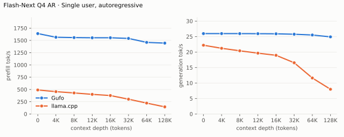
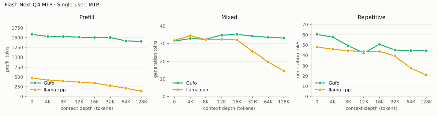

# Qwen3.8 Flash-Next benchmarks

AMD Strix Halo `gfx1151`, 128 GB unified memory. Unsloth `UD-Q4_K_XL` target and
shared-Q8_0 MTP sidecar; Gufo uses adaptive MTP. HTTP, greedy, thinking off.
Gufo single-user tg: September 27, 2026 (`f797b5b`); pp and other results:
September 22–23. Concurrency uses the unchanged short-context attention path.
llama.cpp uses `b11069` for AR and `6fcaa16f` for MTP.

Gufo TP2 runs the same tables on two such hosts that split every layer and
exchange partial sums over InfiniBand RDMA ([TP2](TP2.md)).

Positive gain favors Gufo.
[Quality and measurement details](QUALITY.md#benchmark-method) · [Model identities](artifacts/model-identities.json)

## Single user, autoregressive

Approximately pp2048 / tg128; depth is the cached prefix in tokens.
Context capacities differ between engines; see the measurement details.

<!-- bench:single-ar -->
| Flash-Next Q4 AR Depth (tokens) | Gufo pp (tok/s) | llama.cpp pp (tok/s) | Gain | Gufo tg (tok/s) | llama.cpp tg (tok/s) | Gain |
| ---: | ---: | ---: | ---: | ---: | ---: | ---: |
| 0 | 1628.52 | 489.59 | +232.6% | 25.87 | 22.20 | +16.5% |
| 4,096 | 1523.39 | 455.24 | +234.6% | 25.84 | 21.21 | +21.8% |
| 8,192 | 1499.13 | 428.85 | +249.6% | 25.84 | 20.40 | +26.7% |
| 12,288 | 1477.98 | 400.21 | +269.3% | 25.80 | 19.64 | +31.4% |
| 16,384 | 1457.16 | 375.89 | +287.7% | 25.79 | 18.95 | +36.1% |
| 32,768 | 1421.93 | 301.31 | +371.9% | 25.69 | 16.54 | +55.3% |
| 65,536 | 1304.01 | 221.94 | +487.6% | 25.41 | 11.62 | +118.7% |
| 131,072 | 1292.02 | 144.78 | +792.4% | 22.89 | 7.98 | +186.8% |
<!-- /bench -->

**Two hosts (TP2 over RDMA).** The same workload on two hosts; gain is TP2 over one host.

<!-- bench:single-ar-tp2 -->
| Flash-Next Q4 AR Depth (tokens) | Gufo pp (tok/s) | Gufo TP2 pp (tok/s) | Gain | Gufo tg (tok/s) | Gufo TP2 tg (tok/s) | Gain |
| ---: | ---: | ---: | ---: | ---: | ---: | ---: |
| 0 | 1628.52 | TODO | TODO | 25.87 | TODO | TODO |
| 4,096 | 1523.39 | TODO | TODO | 25.84 | TODO | TODO |
| 8,192 | 1499.13 | TODO | TODO | 25.84 | TODO | TODO |
| 12,288 | 1477.98 | TODO | TODO | 25.80 | TODO | TODO |
| 16,384 | 1457.16 | TODO | TODO | 25.79 | TODO | TODO |
| 32,768 | 1421.93 | TODO | TODO | 25.69 | TODO | TODO |
| 65,536 | 1304.01 | TODO | TODO | 25.41 | TODO | TODO |
| 131,072 | 1292.02 | TODO | TODO | 22.89 | TODO | TODO |
<!-- /bench -->

## Single user, MTP

pp is the highest measured rate per engine and depth across mixed/repetitive
text, including Gufo predictor catch-up.

<!-- bench:single-mtp -->
| Flash-Next Q4 MTP Depth (tokens) | Gufo pp (tok/s) | llama.cpp pp (tok/s) | Gain pp | Gufo tg mixed (tok/s) | llama.cpp tg mixed (tok/s) | Gain mixed | Gufo tg repetitive (tok/s) | llama.cpp tg repetitive (tok/s) | Gain repetitive |
| ---: | ---: | ---: | ---: | ---: | ---: | ---: | ---: | ---: | ---: |
| 0 | 1602.82 | 468.76 | +241.9% | 32.20 | 31.73 | +1.5% | 59.30 | 48.12 | +23.2% |
| 4,096 | 1506.32 | 423.79 | +255.4% | 32.50 | 34.48 | -5.7% | 46.74 | 45.71 | +2.3% |
| 8,192 | 1492.95 | 394.98 | +278.0% | 36.08 | 32.20 | +12.0% | 50.26 | 44.31 | +13.4% |
| 12,288 | 1488.03 | 365.91 | +306.7% | 34.26 | 32.32 | +6.0% | 44.81 | 43.53 | +2.9% |
| 16,384 | 1471.81 | 341.98 | +330.4% | 35.41 | 32.07 | +10.4% | 53.53 | 43.66 | +22.6% |
| 32,768 | 1449.56 | 277.61 | +422.2% | 31.03 | 25.41 | +22.1% | 44.96 | 39.28 | +14.5% |
| 65,536 | 1316.70 | 208.04 | +532.9% | 32.63 | 19.65 | +66.1% | 46.12 | 27.75 | +66.2% |
| 131,072 | 1335.91 | 135.42 | +886.5% | 34.20 | 14.63 | +133.8% | 45.01 | 20.96 | +114.7% |
<!-- /bench -->

**Two hosts (TP2 over RDMA).** The same workloads on two hosts; gain is TP2 over one host.

<!-- bench:single-mtp-tp2 -->
| Flash-Next Q4 MTP Depth (tokens) | Gufo pp (tok/s) | Gufo TP2 pp (tok/s) | Gain pp | Gufo tg mixed (tok/s) | Gufo TP2 tg mixed (tok/s) | Gain mixed | Gufo tg repetitive (tok/s) | Gufo TP2 tg repetitive (tok/s) | Gain repetitive |
| ---: | ---: | ---: | ---: | ---: | ---: | ---: | ---: | ---: | ---: |
| 0 | 1602.82 | TODO | TODO | 32.20 | TODO | TODO | 59.30 | TODO | TODO |
| 4,096 | 1506.32 | TODO | TODO | 32.50 | TODO | TODO | 46.74 | TODO | TODO |
| 8,192 | 1492.95 | TODO | TODO | 36.08 | TODO | TODO | 50.26 | TODO | TODO |
| 12,288 | 1488.03 | TODO | TODO | 34.26 | TODO | TODO | 44.81 | TODO | TODO |
| 16,384 | 1471.81 | TODO | TODO | 35.41 | TODO | TODO | 53.53 | TODO | TODO |
| 32,768 | 1449.56 | TODO | TODO | 31.03 | TODO | TODO | 44.96 | TODO | TODO |
| 65,536 | 1316.70 | TODO | TODO | 32.63 | TODO | TODO | 46.12 | TODO | TODO |
| 131,072 | 1335.91 | TODO | TODO | 34.20 | TODO | TODO | 45.01 | TODO | TODO |
<!-- /bench -->

## Multiple users, autoregressive

Same pp2048 prose prompt as single-user d0, tg128, context 4096 per user.
All sessions prefilled before timed decoding; throughput sums individual rates.
llama.cpp re-evaluates its four-token checkpoint tail.

<!-- bench:multi-ar -->
| Flash-Next Q4 AR Users | Gufo AR (tok/s) | llama.cpp AR (tok/s) | Gain |
| ---: | ---: | ---: | ---: |
| 1 | 25.85 | 22.34 | +15.7% |
| 2 | 45.70 | 37.08 | +23.2% |
| 4 | 76.29 | 54.82 | +39.2% |
| 6 | 95.66 | 65.34 | +46.4% |
| 8 | 108.67 | 68.79 | +58.0% |
<!-- /bench -->

**Two hosts (TP2 over RDMA).** The same users on two hosts; gain is TP2 over one host.

<!-- bench:multi-ar-tp2 -->
| Flash-Next Q4 AR Users | Gufo AR (tok/s) | Gufo TP2 AR (tok/s) | Gain |
| ---: | ---: | ---: | ---: |
| 1 | 25.85 | TODO | TODO |
| 2 | 45.70 | TODO | TODO |
| 4 | 76.29 | TODO | TODO |
| 6 | 95.66 | TODO | TODO |
| 8 | 108.67 | TODO | TODO |
<!-- /bench -->

## Multiple users, MTP

Same pp2048 mixed/repetitive prompts as single-user d0, tg128, context 4096
per user. All sessions prefilled before timed decoding; rates sum individual
request decode rates. C1 cross-checks the single-user table.

<!-- bench:multi-mtp -->
| Flash-Next Q4 MTP Users | Gufo mixed (tok/s) | llama.cpp mixed (tok/s) | Gain | Gufo repetitive (tok/s) | llama.cpp repetitive (tok/s) | Gain |
| ---: | ---: | ---: | ---: | ---: | ---: | ---: |
| 1 | 32.09 | 31.77 | +1.0% | 59.20 | 46.93 | +26.1% |
| 2 | 51.68 | 42.79 | +20.8% | 93.16 | 52.57 | +77.2% |
| 4 | 75.92 | 48.78 | +55.6% | 127.91 | 48.23 | +165.2% |
| 6 | 89.18 | 52.59 | +69.6% | 142.14 | 48.51 | +193.0% |
| 8 | 106.47 | 61.92 | +71.9% | 157.22 | 58.13 | +170.5% |
<!-- /bench -->

**Two hosts (TP2 over RDMA).** The same users on two hosts; gain is TP2 over one host.

<!-- bench:multi-mtp-tp2 -->
| Flash-Next Q4 MTP Users | Gufo mixed (tok/s) | Gufo TP2 mixed (tok/s) | Gain | Gufo repetitive (tok/s) | Gufo TP2 repetitive (tok/s) | Gain |
| ---: | ---: | ---: | ---: | ---: | ---: | ---: |
| 1 | 32.09 | TODO | TODO | 59.20 | TODO | TODO |
| 2 | 51.68 | TODO | TODO | 93.16 | TODO | TODO |
| 4 | 75.92 | TODO | TODO | 127.91 | TODO | TODO |
| 6 | 89.18 | TODO | TODO | 142.14 | TODO | TODO |
| 8 | 106.47 | TODO | TODO | 157.22 | TODO | TODO |
<!-- /bench -->

## Two hosts, Q8 (TP2 over RDMA)

The full Q8_0 target does not fit one host. Single user on two hosts,
pp2048/tg128 by depth as above; prefill on the left axis, generation on the
right.

<!-- bench:tp2-q8 -->
| Flash-Next Q8 TP2 Depth (tokens) | pp (tok/s) | tg AR (tok/s) | tg MTP mixed (tok/s) | tg MTP repetitive (tok/s) |
| ---: | ---: | ---: | ---: | ---: |
| 0 | TODO | TODO | TODO | TODO |
| 4,096 | TODO | TODO | TODO | TODO |
| 8,192 | TODO | TODO | TODO | TODO |
| 12,288 | TODO | TODO | TODO | TODO |
| 16,384 | TODO | TODO | TODO | TODO |
| 32,768 | TODO | TODO | TODO | TODO |
| 65,536 | TODO | TODO | TODO | TODO |
| 131,072 | TODO | TODO | TODO | TODO |
<!-- /bench -->

## Loading time

C1, context capacity 262144, MTP. Cold target/sidecar files to HTTP readiness.

<!-- bench:loading -->
| Flash-Next Q4 Target | Gufo ready (s) | llama.cpp ready (s) | Gain |
| --- | ---: | ---: | ---: |
| Q4 | 15.45 | 117.83 | +662.7% |
<!-- /bench -->

## Memory occupation

C1, context capacity 133121, AR. Peak memory reported by HIP.

<!-- bench:memory -->
| Flash-Next Q4 AR Workload | Gufo GiB | llama.cpp GiB | Gain |
| --- | ---: | ---: | ---: |
| pp2048 + tg128 | 85.55 | 84.84 | -0.8% |
| 16K prefix, pp4096 + tg128 | 86.27 | 85.31 | -1.1% |
<!-- /bench -->

